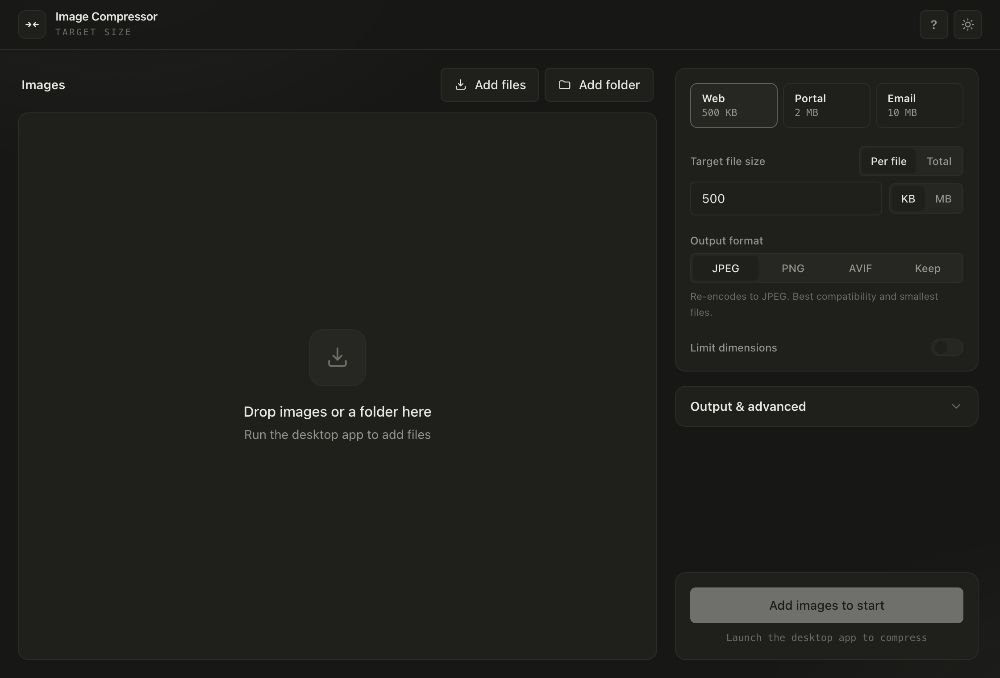

# Image Compressor

A standalone Windows + macOS desktop app that compresses and resizes images to hit a **target file size** (a KB or MB cap) — one image or a whole batch. Fast, fully offline, no network calls. Built with Tauri 2; the compression engine is pure Rust.

> "Get this under 500 KB." "Get all of these under 2 MB."



## Features

- Compress a single image or a whole batch (drag-and-drop files/folders, or the native picker; folders are scanned recursively)
- **Target file size** with a KB / MB toggle, plus an optional max-dimension (longest edge) cap
- **Per-file cap overrides**, or a **total-folder budget** mode that fits a whole set under one combined cap (split across images by size)
- Input: JPEG, PNG, WebP, TIFF. Output: JPEG (default), PNG (lossless, oxipng-optimized), or AVIF (best ratio, slower), plus "keep original"
- **Live before/after preview** — click any image to preview it; the size/quality readout recomputes instantly as you change settings (the decoded source is cached, so tweaks are fast)
- **Thumbnails** in the file list, with a selectable preview target
- Transparency handling: PNG/AVIF keep alpha; JPEG flattens onto a configurable background color
- Parallel batch processing (Rust `rayon`, capped to the core count) with overall + per-file progress
- **Cancel** mid-run with accurate partial results
- **Per-file isolation:** a corrupt or unreachable file is recorded with a reason and the batch continues — it never aborts the job or panics
- Result summary per file: original → final size, % saved, final quality/dimensions, and any failures
- Built-in help panel, light / dark themes, keyboard-operable, AA contrast

## How the target-size algorithm works

Each image is decoded once and (optionally) downscaled to a max long edge. The encoder quality is then **binary-searched** for the largest file that still fits the cap. If even the lowest quality is over the cap, the dimensions are downscaled (by a factor derived from the size overshoot, clamped) and the search retries. If the longest edge falls below a 16 px floor and the cap still can't be met, the file is marked **unreachable**. All search happens in memory: each source is decoded once and written once.

When a cap is reachable the output is **always ≤ the cap**, and the search returns the best quality under the cap (one quality step higher would exceed it). Rust tests assert exactly this.

## Tech stack

- **Tauri 2** — Rust core; WebView2 on Windows, WKWebView on macOS
- **React 18 + TypeScript (strict) + Vite** frontend, **Tailwind CSS**, **Zustand** state
- Tauri plugins: `dialog`, `fs`, `store`
- Engine crates: `image` (decode/encode), `ravif` (AVIF), `oxipng` (lossless PNG optimization), `fast_image_resize` (Lanczos3 resize), `rayon`, `thiserror`, `serde`

The compression engine is a **separate workspace crate** (`src-tauri/crates/engine`) with **no Tauri dependency**, so it is platform-neutral and unit-testable on its own.

## Project structure

```
.
├── src/                       # React + TypeScript frontend
│   ├── components/            # Intake, CapControls, PresetBar, Settings, RunBar, SummaryBanner …
│   ├── lib/                   # tauri bridge, types, format helpers, icons, theme
│   └── store/                 # Zustand store
├── src-tauri/                 # Tauri app
│   ├── src/                   # commands.rs, lib.rs (thin bridge to the engine)
│   ├── crates/engine/         # pure-Rust target-size engine (no Tauri deps)
│   ├── capabilities/          # scoped permissions
│   └── tauri.conf.json
├── .github/workflows/release.yml   # dual-OS installer build
└── package.json
```

## Prerequisites

- Node.js 18+ and npm
- The Rust toolchain (`rustup` / `cargo`)
- **Windows:** Microsoft C++ Build Tools (MSVC) and the WebView2 runtime (usually preinstalled on Win 10/11)
- **macOS:** Xcode command-line tools (`xcode-select --install`)

## Development

```bash
npm install
npm run tauri dev     # launch the desktop app with hot reload
npm run dev           # frontend only, in a browser (no Rust backend)
npm run tauri build   # build an installer for the current OS
```

## Quality checks

```bash
npm run verify            # typecheck + ESLint (0 warnings) + Vitest + cargo fmt/clippy/test
npm run rust:test-engine  # run just the engine tests (fast)
```

Enforced hard rules: no `any` / `@ts-ignore` / `eslint-disable`; no Rust `unwrap`/`expect`/`panic!` outside tests; no OS-specific branching in the engine.

## Building installers (Windows + macOS)

You cannot build both installers on one machine — each OS's bundle must be built on that OS. A GitHub Actions release workflow (`.github/workflows/release.yml`) uses a matrix of `windows-latest` and `macos-latest` with `tauri-action` to build both from one version tag:

- Windows → `.msi` (WiX) and `.exe` (NSIS)
- macOS → universal `.dmg` / `.app` (Apple Silicon + Intel)

Push a tag like `v0.3.3` to trigger it; the workflow creates a draft GitHub Release and attaches the installers. Optional code signing — Windows Authenticode, macOS Developer ID + notarization — is left to the maintainer.

## Encoder backend (a deliberate decision)

The app uses **pure-Rust encoders** so it builds cleanly on both Windows and macOS with no C toolchain: the `image` crate for JPEG (quality search) and PNG (lossless), and `ravif` for AVIF (best ratio, slower to encode). Lossy **WebP** is the one format still deferred — it needs a native library (libwebp) that adds build friction — rather than forced. This follows the spec's library-risk guidance.

## License

MIT
